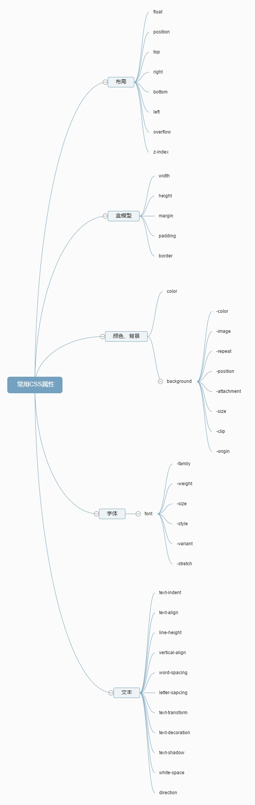

# 常用属性

## visibility属性

* hidden：元素不可见。

    与display:none不同，hidden仍占用空间，只是不可见，而display:none不占用空间。

* visible：元素可见

隐藏的元素（占用空间）：
<jsrun id="AUZKp" type="result,html,css" height="250px"></jsrun>

显示的元素：
<jsrun id="jUZKp" type="result,html,css" height="250px"></jsrun>

<interactive-counter></interactive-counter>
