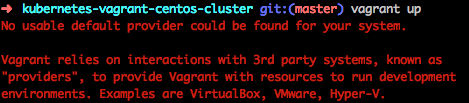
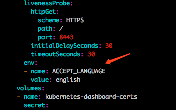

# 本地测试环境搭建

本机环境是: osx 10.13.6 [VirtualBox](https://www.virtualbox.org/wiki/Downloads) [Vagrant](https://www.vagrantup.com/downloads.html)

```bash
#设置代理,下载速度更快
export http_proxy=http://yourproxy:8080
export https_proxy=http://yourproxy:8080

# setup
git clone https://github.com/rootsongjc/kubernetes-vagrant-centos-cluster.git
cd kubernetes-vagrant-centos-cluster

# 设置vagrant 代理插件
vagrant plugin install vagrant-proxyconf
export VAGRANT_HTTP_PROXY=http://yourproxy:8080
export VAGRANT_NO_PROXY="127.0.0.1"

# 下载k8s
wget https://storage.googleapis.com/kubernetes-release/release/v1.11.0/kubernetes-server-linux-amd64.tar.gz

# 启动,如果没有会去下载 centos 镜像
vagrant up
```

# 测试

直接通过dashboard UI来访问：https://172.17.8.101:8443

## 获取 token
vagrant ssh node1
sudo -i
kubectl -n kube-system describe secret `kubectl -n kube-system get secret|grep admin-token|cut -d " " -f1`|grep "token:"|tr -s " "|cut -d " " -f2

## 查看 pod
kubectl get nodes
kubectl get pods --all-namespaces=true

# 组件

## 流量可视化
https://github.com/Netflix/vizceral

## kubernetes 包管理工具

    https://github.com/helm/helm
    https://yq.aliyun.com/articles/159601
    # helm 私有源
    http://www.itdaan.com/blog/2018/04/17/4d13284a5f82490231c8c00e36081c0b.html


# 踩坑记录

## vagrant

当你长期不用vagrant,版本可能跟不上VirtualBox
这时候需要修复镜像

```bash
vagrant plugin repair
```

## vagrant k8s 占用内存过大

内存足足占用了9G
```bash
vim Vagrantfile

vb.memory = "3072"
修改为想要的
vb.memory = "1024"

# 重启
vagrant reload
# vagrant reload --provision 会执行初始化脚本,我们已经做过无需再来一次
```

# 配置语言

## 方法一
我们看到现在 dashboard 的页面都已经被汉化了
您使用的Chrome浏览器，则在浏览器中的配置中设置语言的顺序后刷新网页，dashboard将以您在Chrome中配置的首选语言显示。
设置 -- 高级 -- 语言 -- 上移英语
就可以看到英文界面了

## 方法二
```bash
vagrant ssh node1
vim /vagrant/addon/dashboard/kubernetes-dashboard.yaml
在kubernetes-dashboard 的
spec -- template -- spec -- containers
中增加配置
env:
  - name: ACCEPT_LANGUAGE
    value: english

# 配置生效
kubectl apply -f /vagrant/addon/dashboard/kubernetes-dashboard.yaml

```


```bash
# 查看升级部署状态
kubectl rollout status deployment kubernetes-dashboard -n kube-system

# 假如出现长时间 padding 的情况可以删除旧的容器
kubectl get pods --all-namespaces=true

# 查看生效情况
kubectl describe deployment kubernetes-dashboard -n kube-system

```


## 配置HPA

### 安装cfssl

```bash
curl -s -L -o /bin/cfssl https://pkg.cfssl.org/R1.2/cfssl_linux-amd64
curl -s -L -o /bin/cfssljson https://pkg.cfssl.org/R1.2/cfssljson_linux-amd64
curl -s -L -o /bin/cfssl-certinfo https://pkg.cfssl.org/R1.2/cfssl-certinfo_linux-amd64
chmod +x /bin/cfssl*
```

### 创建证书

进入 apiserver 所在服务器
```bash
vagrant ssh node1
cd /etc/kubernetes/ssl
```

或者按照下面直接修改vagrant 然后  vagrant destroy -f && vagrant up  重新初始化

```bash
kubernetes-vagrant-centos-cluster/conf/apiserver
kubernetes-vagrant-centos-cluster/conf/controller-manager
kubernetes-vagrant-centos-cluster/pki
创建证书

```

```bash
# 创建证书
# 注意： CN 名称为 front-proxy-client，需要与 kube-apiserver 的 --requestheader-allowed-names 参数配置一致；
vim front-proxy-client-csr.json
{
    "CN": "front-proxy-client",
    "key": {
        "algo": "rsa",
        "size": 2048
    }
}

cfssl gencert -ca=ca.pem \
-ca-key=ca-key.pem \
-config=ca-config.json \
-profile=kubernetes front-proxy-client-csr.json | cfssljson -bare front-proxy-client


# kube-apiserver 开启 aggregation

vim /etc/kubernetes/apiserver
在 KUBE_API_ARGS 配置末尾增加
--requestheader-allowed-names=front-proxy-client  --requestheader-extra-headers-prefix=X-Remote-Extra-  --requestheader-group-headers=X-Remote-Group  --requestheader-username-headers=X-Remote-User  --requestheader-client-ca-file=/etc/kubernetes/ssl/ca.pem  --proxy-client-cert-file=/etc/kubernetes/ssl/front-proxy-client.pem  --proxy-client-key-file=/etc/kubernetes/ssl/front-proxy-client-key.pem  --enable-aggregator-routing=true

# 在 kube-controller-manager 中添加参数
vim /etc/kubernetes/controller-manager
在 KUBE_CONTROLLER_MANAGER_ARGS 配置末尾增加
--horizontal-pod-autoscaler-use-rest-clients=true

# 重启服务
systemctl daemon-reload
systemctl restart kube-apiserver.service
systemctl restart kube-controller-manager

```

### 部署metrics-server

```bash
git clone https://github.com/kubernetes-incubator/metrics-server


vim deploy/1.8+/metrics-server-deployment.yaml
---
apiVersion: v1
kind: ServiceAccount
metadata:
  name: metrics-server
  namespace: kube-system
---
apiVersion: extensions/v1beta1
kind: Deployment
metadata:
  name: metrics-server
  namespace: kube-system
  labels:
    k8s-app: metrics-server
spec:
  selector:
    matchLabels:
      k8s-app: metrics-server
  template:
    metadata:
      name: metrics-server
      labels:
        k8s-app: metrics-server
    spec:
      serviceAccountName: metrics-server
      volumes:
      # mount in tmp so we can safely use from-scratch images and/or read-only containers
      - name: tmp-dir
        emptyDir: {}
      - name: ca-ssl
        hostPath:
          path: /etc/kubernetes/ssl
      containers:
      - name: metrics-server
        image: k8s.gcr.io/metrics-server-amd64:v0.3.1
        imagePullPolicy: Always
        volumeMounts:
        - name: tmp-dir
          mountPath: /tmp
        - mountPath: /etc/kubernetes/ssl/
          name: ca-ssl
        command:
        - /metrics-server
        - --requestheader-client-ca-file=/etc/kubernetes/ssl/ca.pem
        - --tls-cert-file=/etc/kubernetes/ssl/front-proxy-client.pem
        - --tls-private-key-file=/etc/kubernetes/ssl/front-proxy-client-key.pem
        - --kubelet-preferred-address-types=InternalIP,Hostname,InternalDNS,ExternalDNS,ExternalIP
        - --kubelet-insecure-tls
      nodeName: "node1"

```

kubectl create -f deploy/1.8+/

### 可能会出现的情况

#### 无法连接apiserver错误

    kubectl -n kube-system logs metrics-server...
    出现 无法连接apiserver错误的情况,我们可以更新 yaml, 增加 env 指定 apiserver 地址
    
```yaml
......
        volumeMounts:
        - name: tmp-dir
          mountPath: /tmp
        env:
        - name: KUBERNETES_SERVICE_HOST
          value: 100.116.82.130
        - name: KUBERNETES_SERVICE_PORT
          value: "8443"
```

执行更新

kubectl apply -f deploy/1.8+/metrics-server-deployment.yaml

### 参考资料

https://github.com/opsnull/follow-me-install-kubernetes-cluster/blob/master/09-4.metrics-server%E6%8F%92%E4%BB%B6.md
https://kubernetes.io/docs/tasks/access-kubernetes-api/configure-aggregation-layer/#before-you-begin
https://kubernetes.io/docs/tasks/run-application/horizontal-pod-autoscale-walkthrough/

### 测试

```bash
kubectl get --raw "/apis/metrics.k8s.io/v1beta1"

# 运行测试服务
kubectl run php-apache --image=k8s.gcr.io/hpa-example --requests=cpu=200m --expose --port=80
```

```bash
# 生成 hpa
kubectl autoscale deployment php-apache --cpu-percent=50 --min=1 --max=10
```

```yaml
# php-apache.yaml
# 使用这个跟上一个命令是一样的
apiVersion: autoscaling/v2beta1
kind: HorizontalPodAutoscaler
metadata:
  name: php-apache
spec:
  scaleTargetRef:
    apiVersion: extensions/v1beta1
    kind: Deployment
    name: php-apache
  minReplicas: 1
  maxReplicas: 10
  metrics:
  - type: Resource
    resource:
      name: cpu
      targetAverageUtilization: 50
  #- type: Resource
  #  resource:
  #    name: memory
  #    targetAverageValue: 200Mi
```

```bash
$ kubectl get hpa
NAME         REFERENCE                     TARGET    MINPODS   MAXPODS   REPLICAS   AGE
php-apache   Deployment/php-apache/scale   0% / 50%  1         10        1          18s
```

```bash
# 发起测试
kubectl run -i --tty load-generator --image=busybox /bin/sh
while true; do wget -q -O- http://php-apache.default.svc.cluster.local; done
```

```bash
# 查看扩容结果
$ kubectl get hpa
NAME         REFERENCE                     TARGET      CURRENT   MINPODS   MAXPODS   REPLICAS   AGE
php-apache   Deployment/php-apache/scale   403% / 50%  305%      1         10        1          3m
```


# kubectl 自动补全

终端下kubectl命令自动补全
建议使用oh-my-zsh，增加对kubectl命令自动补全支持。

修改~/.zshrc文件，增加如下两行：

```bash
plugins=(kubectl)
source <(kubectl completion zsh)
```

保存后重启终端即可生效。


# kubectl 切换多个集群

编辑配置合并到
~/.kube/config

只要cluster1,user1,context1等对应上就可以了,名字可以改不重要.

```yaml
# ~/.kube/config
apiVersion: v1
clusters:
- cluster:
    certificate-authority-data: LS0tL...=
    server: https://1.2.3.4:443
  name: cluster1
- cluster:
    certificate-authority-data: BBCCDD...=
    server: https://5.6.7.8:443
  name: cluster2

contexts:
- context:
    cluster: cluster1
    user: user1
  name: context1
- context:
    cluster: cluster2
    user: user2
  name: context2
current-context: context1
kind: Config
preferences: {}
users:
- name: user1
  user:
    client-certificate-data: LS0...
    client-key-data: LS0tL...=
- name: user2
  user:
    client-certificate-data: FFGG...
    client-key-data: HHIIJJ...=
```

[kubeconfig配置参考资料](https://jimmysong.io/kubernetes-handbook/guide/authenticate-across-clusters-kubeconfig.html)
